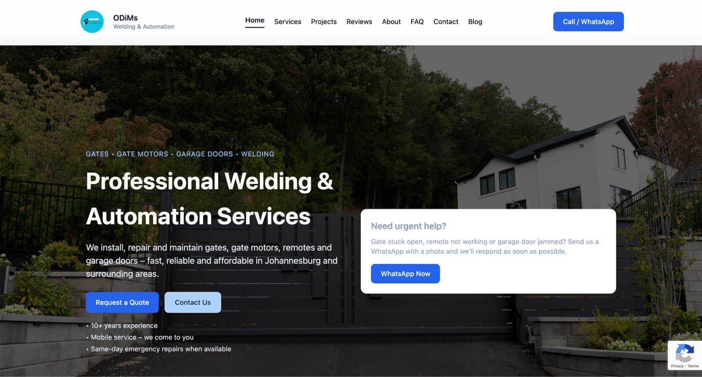
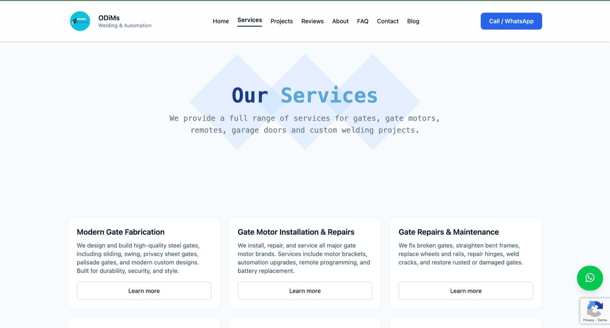
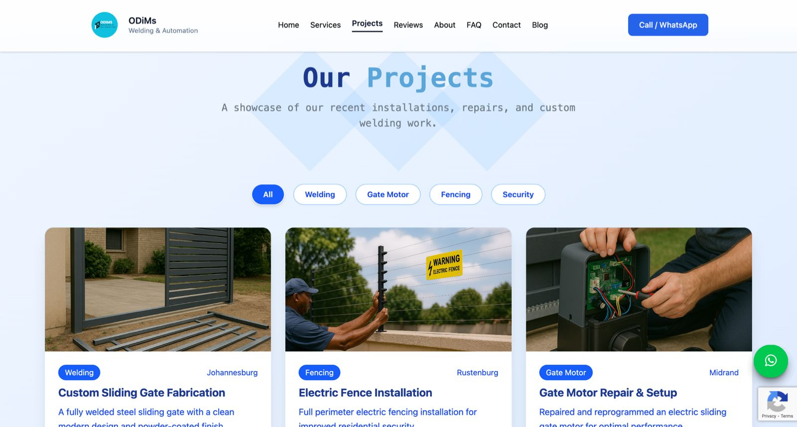
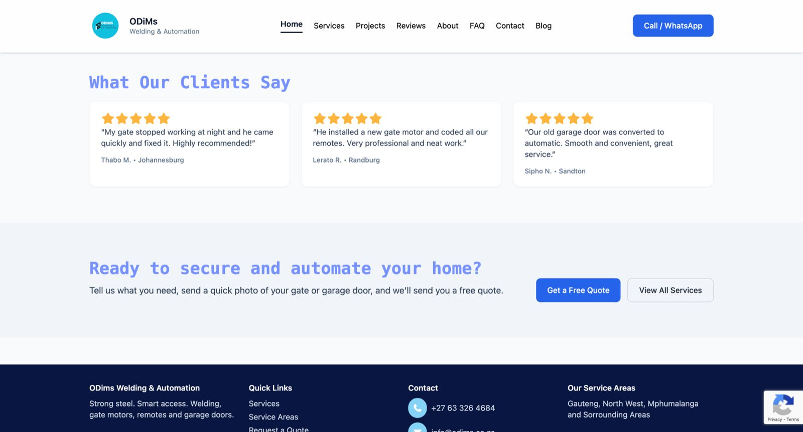
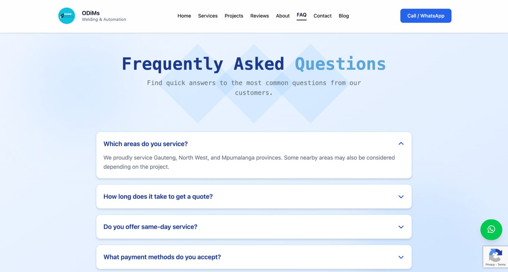

# Odims Welding & Automation 🔧⚙️

 

  
  

  
  

Odims Welding & Automation is a modern business website built to showcase welding, fabrication, and automation services, help customers understand what the company offers, and make it easy to request a quote or contact the team.

---

## 🚀 Features

- Responsive modern UI (mobile + desktop)
- Services showcase (Welding, Fabrication, Automation, Repairs, etc.)
- About section + company overview
- Contact form (enquiries / quote requests)
- Quick call/email links for customers
- Location / service area details (optional)
- SEO-friendly structure for better Google visibility

---

## 🛠️ Tech Stack

- **Next.js / React**
- **Tailwind CSS**
- **JavaScript**
-  **Email service integration** ( Resend )
-  **Supabase for storing form submissions

---

